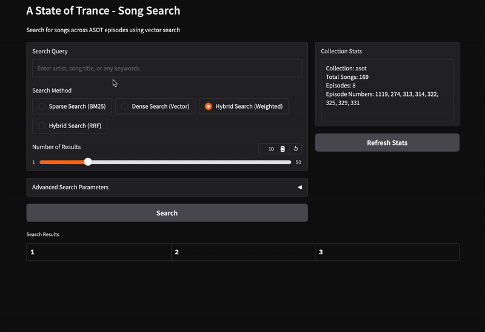

# 🎵 AISOT: A State of Trance AI-Powered Search Engine


AISOT is a specialized search engine for exploring tracks played on Armin van Buuren's "A State of Trance" radio show. This project demonstrates the power of modern RAG (Retrieval Augmented Generation) techniques combined with vector databases to create a semantic search experience for music discovery.

## 📋 Table of Contents

- [Overview](#-overview)
- [Features](#-features)
- [Technology Stack](#-technology-stack)
- [Project Structure](#-project-structure)
- [Installation](#-installation)
- [Usage](#-usage)
- [RAG Architecture Explained](#-rag-architecture-explained)
- [Vector Search Explained](#-vector-search-explained)
- [Contributing](#-contributing)
- [License](#-license)

## 🔭 Overview

AISOT scrapes and indexes tracklists from A State of Trance episodes, creating a searchable database of trance music. Whether you're looking for a specific track, artist, or even a style of trance music, AISOT's semantic search capabilities help you find relevant results across hundreds of episodes.



## ✨ Features

- **Multi-modal Search**: Combine keyword-based and semantic search for optimal results
- **Episode Scraping**: Automatically extract tracklists from ASOT episode pages
- **Intelligent Parsing**: Use Claude AI to understand and structure song information
- **Hybrid Search Options**: Choose between BM25, vector embeddings, or hybrid approaches
- **Simple Interface**: Clean Gradio UI for easy searching and exploration

## 🛠 Technology Stack

### Core Technologies

- **🐍 Python**: Primary programming language
- **📊 Milvus**: Vector database for efficient similarity search
- **🤖 Claude**: AI language model for processing and understanding music data
- **💻 Gradio**: Web interface for easy interaction with the search system
- **🔍 FireCrawl**: Web scraping tool for episode page extraction

### Libraries & Frameworks

- **📚 sentence-transformers**: For generating dense vector embeddings
- **🔢 NumPy/Pandas**: For data manipulation and analysis
- **🔄 Requests**: For API communication
- **📝 Markdown**: For data representation

## 📂 Project Structure

```
aisot/
├── data/                   # Scraped and processed episode data
├── Media/                  # Project images and demo files
├── src/                    # Core source code
│   ├── episodes_ingestion.py     # Episode data ingestion pipeline
│   ├── Logger.py                 # Logging utilities
│   ├── MilvusClientASOT.py       # Vector database interface
│   ├── process_asot_episode.py   # Episode processing logic
│   ├── scraper.py               # Web scraping functionality
│   ├── Singleton.py             # Utility patterns
│   ├── song_parser.py           # Song metadata parsing with Claude
│   └── unity_json.py            # JSON processing utilities
├── .gitignore              # Git ignore file
├── asot_search.py          # Main search application
├── env.example             # Environment variables template
├── episodes_to_insert.txt  # List of episodes to process
├── README.md               # Project documentation
├── requirements.txt        # Dependencies
└── sandbox.ipynb           # Development and testing notebook
```

## 📥 Installation

1. **Clone the repository:**

```bash
git clone https://github.com/yourusername/aisot.git
cd aisot
```

2. **Create and activate a virtual environment:**

```bash
python -m venv venv
source venv/bin/activate  # On Windows: venv\Scripts\activate
```

3. **Install dependencies:**

```bash
pip install -r requirements.txt
```

4. **Set up environment variables:**

```bash
cp env.example .env
```

Edit the `.env` file with your API keys and configuration settings:

```
MILVUS_COLLECTION=asot
ANTHROPIC_API_KEY=your_anthropic_api_key
OUTPUT_FOLDER=data
LOG_MISC=DEBUG
```

5. **Start Milvus database:**
   Milvus can be run using Docker:

```bash
docker run -d --name milvus-standalone -p 19530:19530 -p 9091:9091 milvusdb/milvus:latest standalone
```

## 🚀 Usage

### Data Ingestion

To scrape and index new ASOT episodes:

1. Add episode URLs to `episodes_to_insert.txt`
2. Run the ingestion script:

```bash
python src/episodes_ingestion.py
```

### Search Interface

Launch the search interface:

```bash
python asot_search.py
```

Navigate to the provided URL (typically http://127.0.0.1:7860) to access the search interface.

The interface provides:

- Text search box for queries
- Selection of search methods (Sparse, Dense, or Hybrid)
- Control over the number of results
- Advanced search parameters for fine-tuning

## 🧠 RAG Architecture Explained

AISOT uses a Retrieval Augmented Generation (RAG) architecture:

1. **Retrieval**: When you search for a track or artist, the system:

   - Converts your query into both sparse (BM25) and dense vector representations
   - Searches the Milvus database for similar vectors
   - Retrieves the most relevant song entries

2. **Augmentation**: The system enriches results with:

   - Episode context (episode number, ranking)
   - Artist information
   - Track details
   - URL links to original episodes

3. **Generation**: While not fully implemented in the current version, the system could be extended to generate:
   - Playlist recommendations based on your query
   - Descriptions of music styles
   - Artist backgrounds

This architecture offers several advantages:

- ✅ **Semantic understanding** of music queries beyond simple keyword matching
- ✅ **Flexible search** combining the strengths of different search methods
- ✅ **Scalable architecture** that can handle growing episode databases

## 📊 Vector Search Explained

AISOT implements three search approaches:

### 1. Sparse Search (BM25)

- Based on traditional information retrieval techniques
- Works well for keyword matching and exact phrases
- Uses an "inverted index" to efficiently find documents containing query terms
- Great for searches like "Armin van Buuren remix" or "trance anthem"

### 2. Dense Search (Vector Embeddings)

- Converts text into high-dimensional vectors that capture semantic meaning
- Uses E5-large-v2 model to generate embeddings
- Finds similar content even when keywords don't match exactly
- Excels at understanding the "meaning" behind queries
- Effective for queries like "uplifting emotional tracks" or "dark progressive tunes"

### 3. Hybrid Search

- Combines the strengths of both approaches
- Can be weighted to favor either sparse or dense results
- Also supports Reciprocal Rank Fusion (RRF) for merging result sets
- Provides the most comprehensive search experience

The vector search is implemented using Milvus, a specialized vector database that allows for:

- **Fast similarity search** using approximate nearest neighbors algorithms
- **Efficient storage** of both sparse and dense vectors
- **Scalable architecture** that can handle millions of records
- **Flexible querying** with multiple ranking approaches

## 👥 Contributing

Contributions are welcome! Please feel free to submit a Pull Request.

1. Fork the repository
2. Create your feature branch (`git checkout -b feature/amazing-feature`)
3. Commit your changes (`git commit -m 'Add some amazing feature'`)
4. Push to the branch (`git push origin feature/amazing-feature`)
5. Open a Pull Request

## 📜 License

This project is licensed under the MIT License - see the LICENSE file for details.

---

🎵 NON-STOP IN THE MIX 🎵
